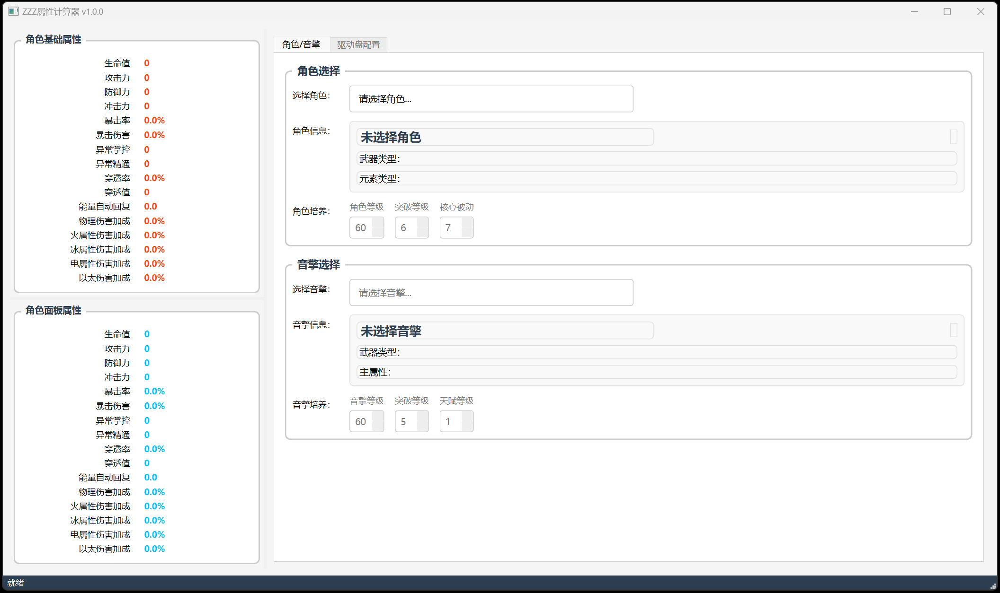
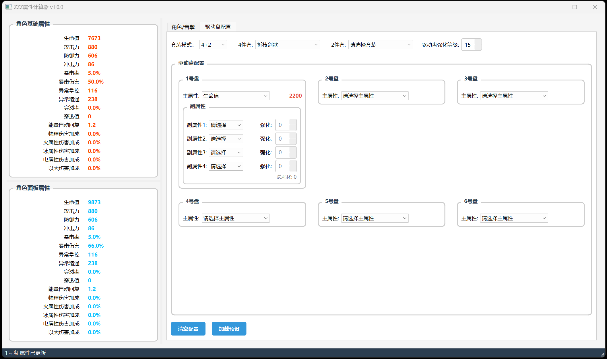

# ZZZ属性计算器

一个为ZZZ开发的属性计算与配装工具，帮助玩家优化角色属性和装备搭配。

## ✨ 功能特性

### 🎮 角色管理
- 选择游戏中的任意角色
- 设置角色等级（1-60级）
- 配置突破等级（1-6级）
- 调整核心被动等级（1-7级）
- 显示角色基础属性和详细资料

### 🔫 音擎配置
- 选择各种音擎（武器）
- 设置音擎等级（1-60级）
- 配置精炼等级（0-5级）
- 调整天赋等级（1-5级）
- 显示音擎属性和效果

### 🛡️ 驱动盘系统
- **套装选择**：支持4+2或2+2+2两种配装模式
- **6盘位独立配置**：每个驱动盘位独立设置
- **主属性选择**：根据盘位提供相应的主属性选项
- **副属性强化**：最多4条副属性，每条可强化0-5次
- **全局强化等级**：一键设置所有驱动盘强化等级
- **实时属性预览**：即时显示每个属性的数值变化

### 📊 属性计算
- **基础属性**：仅角色自身属性
- **面板属性**：角色+音擎后的属性
- **最终属性**：包含所有装备和加成的完整属性
- **实时更新**：任何配置变化立即反映到属性计算

### 💾 数据管理
- 本地JSON数据存储
- 支持离线使用
- 模块化数据解析
- 自动缓存优化

## 🖼️ 界面预览

*主界面 - 左侧显示属性，右侧进行配置*

*驱动盘配置界面 - 详细的套装和属性选择*

## 🚀 快速开始

### 系统要求
- **操作系统**：Windows 10/11
- **Python版本**：Python 3.8 或更高版本
- **屏幕分辨率**：建议 1920×1080 或更高
- **内存**：至少 2GB 可用内存

*注意：当前版本仅支持 Windows 系统。*

### 安装方法(还未实现)

#### 下载预编译版本
1. 前往 [Releases](https://github.com/your-username/zzz-calculator/releases) 页面
2. 下载对应系统的可执行文件：
   - Windows: `zzz-calculator-windows.zip`
3. 解压下载的文件
4. 直接运行 `zzz-calculator.exe`（Windows）
